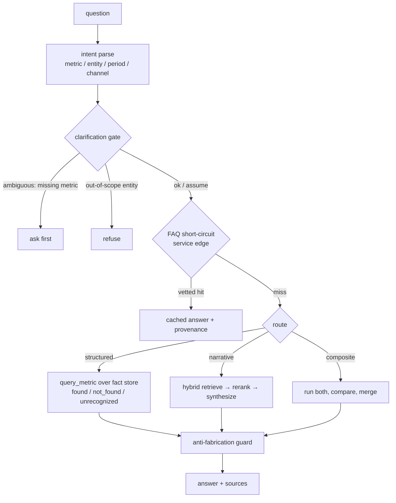

RAGSpine is a backend RAG engine you **assemble in plain Python** — not a framework you
submit to. There is no Dify, no LangGraph, no graph DSL, and no runtime to host. It is a
coherent, batteries-included library of composable parts — retrieval, agent orchestration,
document extraction, evaluation, and an HTTP service layer — wired together by ordinary
functions and typed `Protocol`s.

This page is the map. It explains the three architectural commitments that shape every
folder, then walks the request lifecycle end to end. The deeper pages drill into the
[request flow](/docs/architecture/request-flow), the [two channels](/docs/architecture/channels),
and the [package layout](/docs/architecture/package-layout).

## Three commitments

<Cards>
  <Card title="Framework-free">
    The core is ordinary Python functions and dataclasses. No orchestration runtime, no DSL, no UI
    you have to adopt. You call `answer_question(...)` and you own the process.
  </Card>
  <Card title="Deep, domain-grouped layout">
    Code is organized by domain, never by technical layer — the folder path locates a file before
    you read its name. A package splits the moment it holds a second responsibility.
  </Card>
  <Card title="Everything is a Protocol">
    LLM provider, embeddings, reranker, OCR, retriever, and task queue are all typed `Protocol`s
    injected at the edges. The core imports zero SDKs and runs offline.
  </Card>
</Cards>

### Framework-free

Most stacks force a choice between hand-rolled glue and heavyweight orchestration platforms
that drag in their own runtime, graph DSL, UI, and lock-in. RAGSpine is the middle path: the
control flow is plain Python you can read top to bottom. The sole public entry to the engine
is `answer_question()` in `agent/agent.py` — a function, not a graph you compile.

### Deep, domain-grouped layout

The repository follows a _screaming architecture_ / _package-by-feature_ stance: organize by
domain/feature, never by technical layer. Find the file by folder first, then read its name.
There are nine top-level domains under `src/ragspine/`, and each one is itself split as soon
as it earns a second concern (for example `extraction/` carries `extractors/`, `routing/`,
`color/`, and `verification/` subtrees). See [Package layout](/docs/architecture/package-layout)
for the full map and the dependency direction.

### Everything is a Protocol

Every external dependency enters through a typed, `@runtime_checkable` `Protocol` injected at
the edges — never an SDK imported in the core:

<TypeTable
  type={{
    LLMProvider: {
      type: 'Protocol',
      description:
        'corespine, re-exported via agent/llm_provider.py — one method, chat(messages, tools) -> ChatCompletion (OpenAI shape). MockProvider is the offline default; AnthropicProvider is real.',
    },
    EmbeddingBackend: {
      type: 'Protocol',
      description:
        'retrieval/lexical/retrieval.py — embed_texts(texts). Default is None = pure BM25, no vector channel.',
    },
    ListwiseJudge: {
      type: 'Protocol',
      description:
        'retrieval/rerank/listwise_rerank.py — judge(query, candidates) returns relevance-sorted indices.',
    },
    NarrativeRetriever: {
      type: 'Protocol',
      description:
        'agent/agent.py — retrieve(query, filters, top_k). The seam the narrative channel plugs into.',
    },
    OcrBackend: {
      type: 'Protocol',
      description: 'extraction — OCR for scanned PDFs, behind the [ocr] extra.',
    },
    TaskQueue: {
      type: 'Protocol',
      description: 'service/tasks — FakeQueue for tests, RQQueue for prod.',
    },
  }}
/>

<Callout type="info">
  Because the core depends on the abstraction and never the SDK, adding a provider, vector store,
  reranker, or OCR engine touches **one new file**. A top-level `import ragspine` eagerly loads no
  domain and pulls no third-party SDK — submodules load lazily (PEP 562), and the `anthropic` SDK is
  lazy-imported only inside `AnthropicProvider.__init__`.
</Callout>

The result: the engine runs fully offline with a deterministic `MockProvider`, the default
narrative retriever is pure CJK-aware BM25, and the bundled demo and 1000+ tests run with no
API key on any platform.

## The request lifecycle

A question travels a fixed, auditable path. Two guards bracket it: a **clarification gateway**
up front that can ask or refuse before any model call, and an **anti-fabrication guard** at
the structured exit that rewrites the answer to "not found" if no fact backs it — regardless
of what the model produced.

```text
question
  → intent parse (metric / entity / period / channel slots)
  → clarification gate ──(ambiguous)→ ask  ──(out-of-scope entity)→ refuse
  → FAQ short-circuit (service edge) ──(vetted hit)→ cached answer + provenance
  → route:
       structured → function-calling over the fact store → found / not_found / unrecognized
       narrative  → hybrid retrieve → listwise rerank → synthesize with citations
       composite  → run both, compare, merge
  → answer + sources   (anti-fabrication guard rewrites to "not found" if no fact)
```

The same flow as a diagram (the ASCII above is the primary; this Mermaid block is an
equivalent view for renderers that support it):



<Callout type="warn">
  The FAQ short-circuit is a **service-edge** optimization (`service/faq/`), not part of the library
  core. The Python `answer_question(...)` entry begins at intent parsing. When the HTTP service is
  in front, a vetted FAQ hit returns before the agent runs at all — but it carries the same
  conservative exclusions, so structured-numeric, competitor, real-time, expired, disabled, and
  `RESTRICTED` questions never short-circuit.
</Callout>

## Where to go next

<Cards>
  <Card
    title="Request flow"
    href="/docs/architecture/request-flow"
    description="The detailed control flow, step by step, grounded in agent/agent.py."
  />
  <Card
    title="Channels"
    href="/docs/architecture/channels"
    description="Structured vs narrative vs composite — what each one runs."
  />
  <Card
    title="Package layout"
    href="/docs/architecture/package-layout"
    description="The nine-domain map and the dependency direction between them."
  />
  <Card
    title="Dual-channel (concept)"
    href="/docs/concepts/dual-channel"
    description="Why two mechanisms, and how the router splits a composite question."
  />
</Cards>
